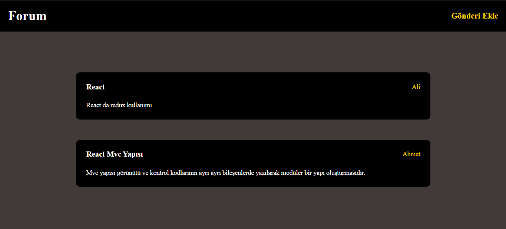
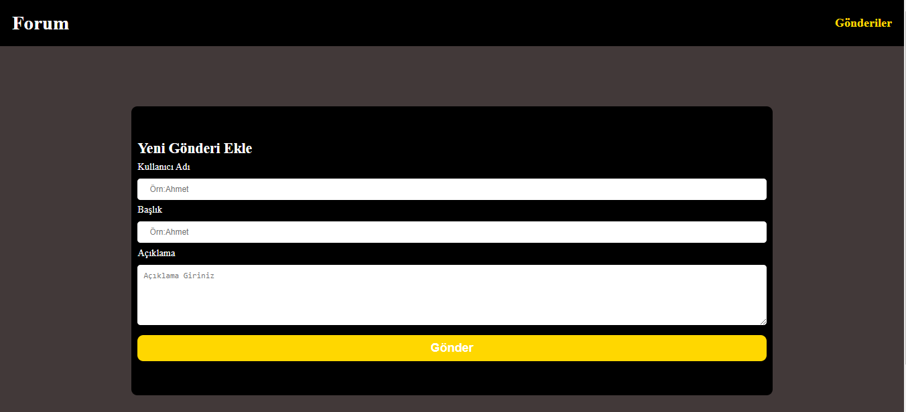
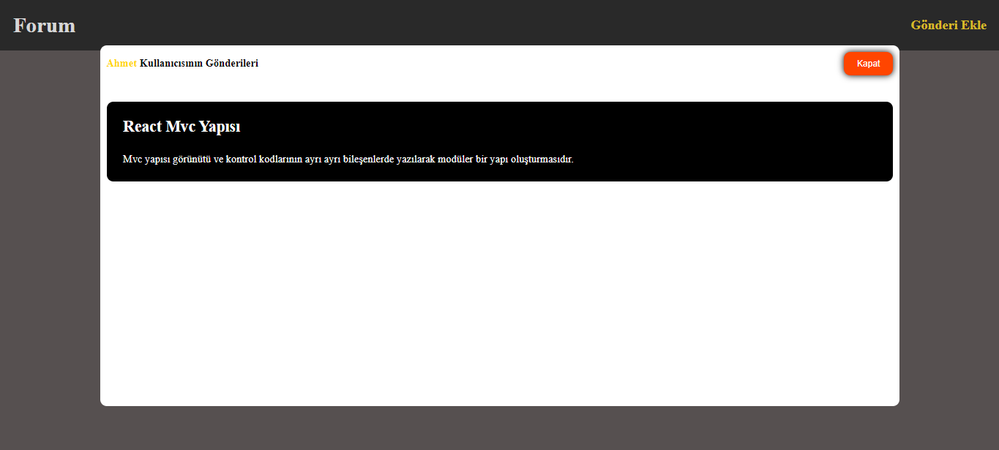

# React Mvc Mimarisi
Mvc (Model View Controller) : Bu mimari, karmaşık uygulamaların geliştirilmesi için yapılandırılmış ve organize bir yol sağlayarak bunların anlaşılmasını, değiştirilmesini ve bakımını kolaylaştırır.

1. Model, uygulamanın verilerini ve mantığını temsil eder. Uygulamanın durumunun yönetilmesinden ve her türlü iş mantığının yönetilmesinden sorumludur. React'ta Model genellikle state ve props özelliklerini kullanarak verileri depolayan ve işleyen bileşenler kullanılarak uygulanır. Bu bileşenler daha karmaşık Modeller oluşturmak için yeniden kullanılabilir ve oluşturulabilir; bu da modüler ve ölçeklenebilir bir geliştirme yaklaşımına olanak tanır.

2. View : Görünüm, uygulamanın görsel temsilidir ve kullanıcı arayüzünün oluşturulmasından sorumludur. React'ta Görünüm, kullanıcı arayüzünün yapısını ve görünümünü tanımlayan bileşenler kullanılarak uygulanır. Bu bileşenler temel olarak Model tarafından sağlanan verilerin görüntülenmesi ve kullanıcı etkileşimlerine yanıt verilmesiyle ilgilidir. React'ın bildirime dayalı yapısı, View bileşenlerinin kolayca oluşturulmasına ve birleştirilmesine olanak tanıyarak, yeniden kullanılabilir UI öğelerinin oluşturulmasını kolaylaştırır. 
3. Controller : Denetleyici, Model ve Görünüm arasında aracı görevi görür. Kullanıcı etkileşimlerini yönetir, Modeli buna göre günceller ve güncellenmiş durumu yansıtacak şekilde Görünümde gerekli değişiklikleri tetikler. React'in özel bir Denetleyici bileşeni yoktur ancak bu rol genellikle View bileşenleri tarafından veya uygulamanın mantık ve durum geçişlerini yöneten ayrı bileşenler tarafından yerine getirilir.

## kütüphaneler

 - json-server
 - axios
 - sass
 - react-router-dom